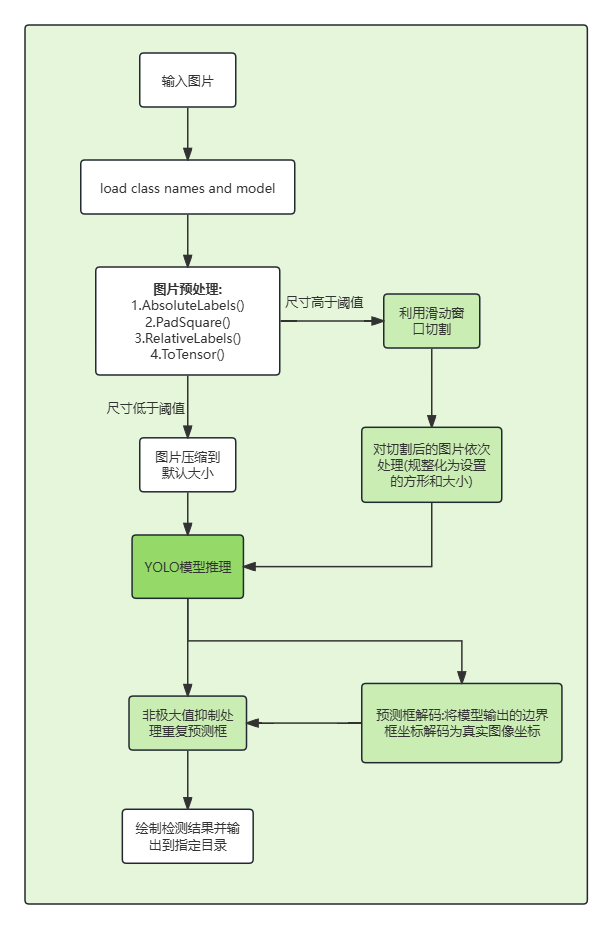

# PyTorch YOLO
A minimal PyTorch implementation of YOLOv3, with support for training, inference, and evaluation.

YOLOv4 and YOLOv7 weights are also compatible with this implementation.

## about

This is an improvement based on the code of another dalao Looking at the [original repository address](https://github.com/eriklindernoren/PyTorch-YOLOv3), here I have made some improvements that I think may be effective in improving performance, but there is no guarantee of correctness

## Installation
### Installing from source

For normal training and evaluation we recommend installing the package from source using a poetry virtual environment.

```bash
git clone https://github.com/yuqiu2004/pytorch-yolo-v3-altered.git
cd pytorch-yolo-v3-altered/
pip3 install poetry --user
poetry install
```

You need to join the virtual environment by running `poetry shell` in this directory before running any of the following commands without the `poetry run` prefix.

## env build suggest 环境搭建建议 适用于 `NVIDIA GeForce RTX 3060`

|  name  | version |
| :----: | :-----: |
| torch  | 1.12.1  |
|  cuda  |  11.6   |
| python | 3.9.20  |
| numpy  | 1.23.4  |

``` shell
# cuda 安装 - 官网命令安装版本和实际的不同
conda install nvidia/label/cuda-11.6.0::cuda --channel nvidia/label/cuda-11.6.0

# cudnn 安装
wget https://developer.nvidia.com/compute/cudnn/secure/8.4.0/local_installers/11.6/cudnn-linux-x86_64-8.4.0.27_cuda11.6-archive.tar.xz
# 解压安装
tar -xvf cudnn-linux-x86_64-8.4.0.27_cuda11.6-archive.tar.xz
cd cudnn-linux-x86_64-8.4.0.27_cuda11.6-archive/
sudo cp include/cudnn*.h /home/yuqiu/miniconda3/envs/itorch/include
sudo cp lib/libcudnn* /home/yuqiu/miniconda3/envs/itorch/lib
sudo chmod a+r /home/yuqiu/miniconda3/envs/itorch/include/cudnn*.h \
               /home/yuqiu/miniconda3/envs/itorch/lib/libcudnn*


# torch 安装
pip install torch==1.12.1+cu116 torchvision==0.13.1+cu116 torchaudio==0.12.1 --extra-index-url https://download.pytorch.org/whl/cu116

# numpy 下载
conda install numpy=1.23.4

# probably error
ImportError: libGL.so.1: cannot open shared object file: No such file or directory
# solve
conda install -c conda-forge opencv
conda install -c conda-forge pyopengl

```


#### Download pretrained weights

```bash
cd weights
./download_weights.sh
cd ..
```

#### Download COCO

```bash
cd data
./get_coco_dataset.sh
cd ..
```

### Install via pip

```bash
pip3 install pytorchyolo --user
```

## Test
Evaluates the model on COCO test dataset.

```bash
poetry run yolo-test --weights weights/yolov3.weights
```

## Inference
Uses pretrained weights to make predictions on images.

```bash
poetry run yolo-detect --images data/samples/
```

## Train
For argument descriptions have a look at `poetry run yolo-train --help`

#### Example (COCO)
To train on COCO using a Darknet-53 backend pretrained on ImageNet run:

```bash
poetry run yolo-train --data config/coco.data  --pretrained_weights weights/darknet53.conv.74
```

#### Tensorboard
Track training progress in Tensorboard:
* Initialize training
* Run the command below
* Go to http://localhost:6006/

```bash
poetry run tensorboard --logdir='logs' --port=6006
```

## Train on Custom Dataset

#### Custom model
Run the commands below to create a custom model definition, replacing `<num-classes>` with the number of classes in your dataset.

```bash
cd config 
./create_custom_model.sh <num-classes>  # Will create custom model 'yolov3-custom.cfg'
```

#### Classes
Add class names to `data/custom/classes.names`. This file should have one row per class name.

#### Image Folder
Move the images of your dataset to `data/custom/images/`.

#### Annotation Folder
Move your annotations to `data/custom/labels/`.

#### Define Train and Validation Sets
In `data/custom/train.txt` and `data/custom/valid.txt`, add paths to images that will be used as train and validation data respectively.

#### Train
To train on the custom dataset run:

```bash
poetry run yolo-train --model config/yolov3-custom.cfg --data config/custom.data
```

## modify on pytorch yolo

### 面向问题

小目标检测效果较差 尤其是分辨率高的图像中 按理说提供了足够的特征 但是因为是直接通过预处理缩放操作舍弃了这部分特征 所以进行部分修改充分利用这部分特征来识别高分辨率图像中的小目标

### 实现思路

原来的检测操作中 会对所有图像进行同一个compose操作 包括缩放 这里我选择将此操作后置 针对每个图像的分辨率大小判断执行哪一种操作

*实现思路流程图*
